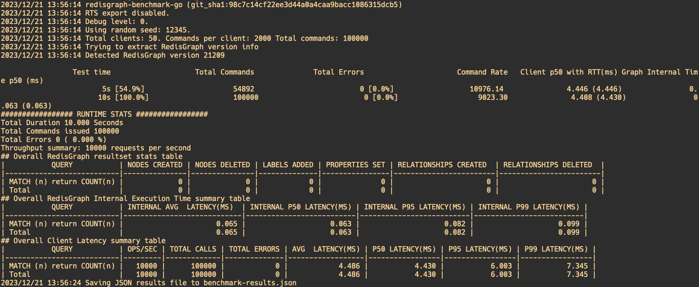

# redisgraph


## deploy redisgraph
we use docker-compose to deploy the redisgraph in our cluster, the deploy yaml is also included under deploy directory
please make sure that you have
```
Docker version 19.03.9
docker-compose version 1.24.1
```
enter the deploy directory then excute command
```
docker-compose up -d
```
then if not problems shown up, the redisgraph will start, exposed port 6379, password is included in conf files

## generate graph and queries
with limitation of memory our linux machine, we choose sf=0.1
you can run the following command to generate data, and please make sure you have already have the sf0.1 directory in current path
```
docker run \
    --mount type=bind,source="$(pwd)/sf0.1",target=/out \
    ldbc/datagen-standalone:0.5.0-2.12_spark3.2 --parallelism 1 -- --format csv --scale-factor 0.1 --mode raw
```

after generating the data, enter the `${pwd}/sf0.1/graphs/csv/raw/composite-merged-fk` directory
setting enviroment variable
```
export LDBC_DATA_DIRECTORY=`pwd`
```

then you need tools from `https://github.com/ldbc/ldbc_snb_example_data`
enter the `ldbc_snb_example_data` directory
you need to downloads DuckDB if it's not yet available
run the following command
```
./load.sh ${LDBC_DATA_DIRECTORY} --no-header
./transform.sh
./export.sh
```
then the data will be processed and stored in the data directory in the current path
the data we need is in `data/csv-only-ids-projected-fk`
there is also another problems in here, in redisgraph and use redisgraph bulk loader, the id must be identical, so the header has to be preprocessed in advance, you can either choose to process it manually or just use the processed csv files under our github directory `parameters`

the queries are accquired from `https://github.com/ldbc/ldbc_snb_interactive_v1_impls/cypher/queries`

## load graph
install the redisgraph-bulk-loader
```
pip install redisgraph-bulk-loader==0.10.2
```
please note that `redisgraph-bulk-loader==0.10.2` requires `redis==4.3.6`

setting enviroment variable IMPORT_DATA_DIR_PROJECTED_FK, which should be the data directory mentioned above

after install the module using the command from `command` file to insert the data into redis, remember to change password if you don't have one or changed, which is configured in conf file, we apply bulking in the same machine that we deploy redisgraph, if you trying to connect to different redisgraph client that not in your machine, please add other parameters, you can check the instructions in redis-bulk-loader github pages


## run the queries to check the system
in this stage, you can first install requirements by
```
pip install -r requirements.txt # in our github directory
```
change the ip address, port and password in `config/config.yaml`

then run to check the system
```
python main.py
```

## about the queries
LDBC benchmark gives a lot of queries to test your database, you can get it from `https://github.com/ldbc/ldbc_snb_interactive_v1_impls`. redisgraph database runs cypher query, so choose the corresponding folder.

data generator gives nodes and relations between nodes. first randomly make 20 samples in relation csv files, second format the cypher query with samples attributes such as id, etc. then run the cypher in redisgraph and get the cypher results, compare it with the csv samples to check whether it's correct.

in manager.py, different functions are defined specifically for different cyphers, ids in samples were passed into function as param, eventually as cypher's param. unfortunately data generator generate data randomly, which means alot properties are missing, cause alot cyphers dysfunctional. to solve this problem we might update cyphers or data

## WorkLoad
LDBC benchmark  consists of two distinct workloads on a common dataset:

1. `The Business Intelligence workload` is focusing on aggregation- and join-heavy complex queries touching a large portion of the graph with microbatches of insert/delete operations.
2. `The Interactive workload` captures transactional graph processing scenario with complex read queries that access the neighbourhood of a given node in the graph and update operations that continuously insert new data in the graph

in phase1, we implemented `The Interactive workload`


## Performance evaluation
In this part, we modify some parts of a open-source tool called redis-benchmark-go then use it as our evaluation tools, since it only supports one graph key read/write concurrently, we extend it to multiple graph key with a Python script file
The installation of this tool could be found via `https://github.com/RedisGraph/redisgraph-benchmark-go`
Besides, our machine is 2c4g, which uses 2 core CPU and 4GB memory

## Result and analysis

1. 100K write commands

    ```
    ./redisgraph-benchmark-go -n 100000 -graph-key graph -query "CREATE (u:User)"
    ```
    

2. 100K read commands

    ```
    ./redisgraph-benchmark-go -n 100000 -graph-key graph2 -query-ro "MATCH (n) return COUNT(n)" -a wikiredis
    ```
    
3. running mixed read and writes benchmark in a single graph
    ```
    ./redisgraph-benchmark-go -n 100000 \
    -graph-key graph \
    -query "CREATE (u:User)" \
    -query-ratio 0.5 \
    -query-ro "MATCH (n) return COUNT(n)" \
    -query-ratio 0.5\
    -a wikiredis \
    ```
    
4. running mixed read and writes benchmark in two graphs we provide a Python script file to excute two command concurrently, just copy the `muti_graph.py` file to the directory which you install the `redis-benchmark-go` tools, then run the file, it will ouput the results into sepreate files, here we give the results of read and write of two graph keys
    ```
    python muti_graph.py
    ```
    #### The write commands into two graph keys, each with 50000 seperately
    #### 1.
    
    #### 2.
    
    #### The read commands into two graph keys, each with 50000 seperately
    #### 1.
    
    #### 2.
    

5. running mixed read and writes benchmark from a remote server

    ```
    ./redisgraph-benchmark-go -n 100000 \
    -graph-key graph \
    -query "CREATE (u:User)" \
    -query-ratio 0.5 \
    -query-ro "MATCH (n) return COUNT(n)" \
    -query-ratio 0.5\
    -a wikiredis \
    -p 6379 \
    -h 43.154.150.30
    ```
    

### Some findings (guessing based on our evaluation, may not be correct 100%)
In our evaluation, we find that:
1. The read, write operation take almost the same time, which is different to the tradtional relational databases that write operation usually take more time than read operation
2. Read, write operation to the same graph key with total request number of 100000 consume time almost equal to read/write operation to the same graph key with 100000 requests, combined with the first findings, we guess that request number is more important than read/write operation when comes to latency.
3. In a remote machine to conduct same test, the latency grows almost 75%, most of which is caused by network reason, the actual excuate time is almost the same to that in the local machine.
4. When sperate the operation equally to two graph key, although the internal excuation time reduce, the total client latency double, we infer that when concurrently operate two graph key, it may take longer time to process the results from internal excuation then return then to the clients.

### Some possible way to improve
1. Reduce network latency as well as possible
2. Since redis store data in memory, increase memory as large as possible to support larger storage and faster process
3. Current Redisgraph doesn't support distributed deployment due to the graph feature constraint, however, based on our finding 4, if we can extend the redisgraph to distributed deployment, and one node to handle single graph write/read, it may improve the performance when the data grows.
4. Another way to improve the performance is that RPC memory call which already purposed by Microsoft. It allows node in distributed system to access remote memory as that locally, it not only reduce the network latency could exist in distributed system, but also allow the api client to process one graph key as all data is stored in which but not restricted by memory size.